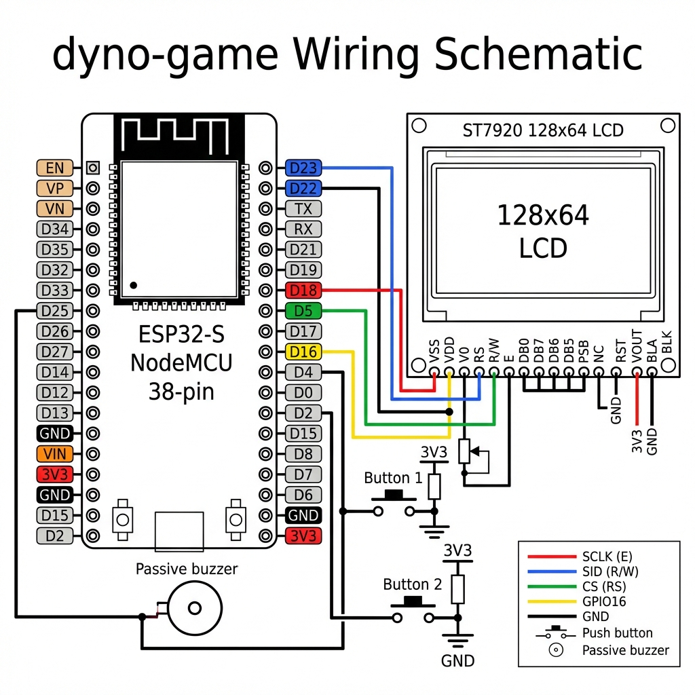

# dyno-game

**Project Title:** dyno-game  
**Module:** Programming Internet of Things  
**University:** Millat Umidi University (MU)  
**Lecturer:** Lazizbek Yusupov  
**Semester:** Fall 2025  

---

## Project Description
**dyno-game** is an academic IoT project that recreates the iconic "Chrome Dino" runner game on an ESP32-S NodeMCU (38-pin) microcontroller. This implementation features real-time sprite-based graphics on an ST7920 128x64 LCD, physical button inputs for game mechanics, and an integrated web server for remote score monitoring.

The project is designed with a clean, modular C++ architecture, separating game physics, display drivers, sound effects, and network communication into distinct modules.

## Features
- **Graphic Display:** High-contrast 128x64 rendering using the U8g2 library on an ST7920 LCD.
- **Game Mechanics:** Integrated Jump and Fast-Fall physics controlled by physical push buttons.
- **Audio System:** Progressive sound effects via a passive buzzer (Jump, Collision, Milestone, and Score).
- **Network Integration:** Built-in web server providing a live HTML scoreboard and a JSON API for data extraction.
- **Modular Codebase:** Organized into logical directories (`game`, `hardware`, `network`) for better maintainability.

## Hardware Components
- ESP32-S NodeMCU (38-pin version)
- ST7920 128x64 Graphics LCD
- Passive Buzzer
- Push Buttons (x2)
- Breadboard and Jumper Wires

## Wiring Diagram


### Pin Mapping (ESP32-S NodeMCU 38-pin)
| Component | Function | ESP32 Pin |
|-----------|----------|-----------|
| **ST7920 LCD** | Clock (E) | GPIO 18 |
| **ST7920 LCD** | Data (RW) | GPIO 23 |
| **ST7920 LCD** | Chip Select (RS) | GPIO 5 |
| **ST7920 LCD** | Reset | GPIO 16 |
| **Push Button 1** | Jump | GPIO 4 |
| **Push Button 2** | Duck/Fast-Fall | GPIO 2 |
| **Passive Buzzer** | Audio Output | GPIO 25 |

*Note: Ensure the ST7920 LCD is set to Serial Mode (PSB pin connected to GND if applicable).*

## Installation and Setup
1. **Clone the repository:**
   ```bash
   git clone https://github.com/Avazkhon-tech/dyno-game.git
   ```
2. **Setup Environment:**
   - Install the **U8g2** library in your Arduino IDE or PlatformIO.
   - Configure your WiFi credentials in `src/main/network/NetworkModule.cpp`.
3. **Upload:**
   - Select "ESP32 Dev Module" as the board.
   - Flash the firmware to the ESP32-S NodeMCU.

## Project Structure
- `src/main/main.ino`: Main orchestration.
- `src/main/game/`: Physics engine and game state management.
- `src/main/hardware/`: Display rendering and buzzer melodies.
- `src/main/network/`: WiFi connectivity and Web Server handlers.
- `src/main/config.h`: System-wide constants and pin definitions.

## Author
**Avazkhon Nazirov**  
Student at Millat Umidi University
